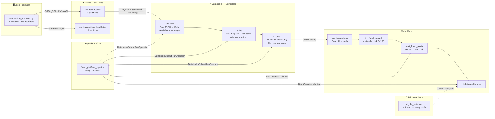
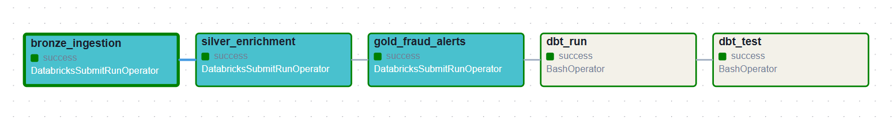

# Real-Time Payment Fraud Detection Platform

[](https://github.com/pavan-4/fraud-detection-platform/actions/workflows/ci_dbt_tests.yml)


I built this project to get hands-on with the tools used in production data engineering — real-time streaming, medallion architecture, dbt transformations, and automated orchestration. The domain is payment fraud detection because it's a genuinely interesting problem: low latency matters, bad data costs money, and the pipeline has to be reliable.

Card transactions are generated by a Kafka producer, streamed into Azure Event Hubs, processed by PySpark Structured Streaming on Databricks, stored in a Delta Lake medallion architecture, transformed by dbt, and the whole thing is orchestrated by Apache Airflow running in Docker. Data quality tests run automatically on every push via GitHub Actions.

---

## Architecture



---



## Tech Stack

| Layer | Tool | Notes |
|---|---|---|
| Event Streaming | Azure Event Hubs (Kafka API) | Standard tier — required for Kafka protocol support |
| Stream Processing | PySpark Structured Streaming | Serverless compute on Databricks Free Edition |
| Storage | Delta Lake + Unity Catalog | ACID transactions, schema enforcement, time-travel |
| Transformation | dbt Core 1.7 | Three-layer SQL models + 11 automated tests |
| Orchestration | Apache Airflow 2.9 | Local Docker, runs the full pipeline every 5 minutes |
| CI/CD | GitHub Actions | Automatically runs dbt tests on every push to main |
| Language | Python 3.10+ | Producer, notebooks, DAG |

---

## Medallion Architecture

| Layer | Table | What it holds |
|---|---|---|
| 🥉 Bronze | `bronze_transactions` | Raw JSON exactly as received from Event Hubs — no changes, append-only |
| 🥈 Silver | `silver_transactions` | Enriched with 4 fraud signals, a risk score (0–100), and a risk label |
| 🥇 Gold | `gold_fraud_alerts` | HIGH-risk transactions only, with a human-readable alert reason |
| dbt mart | `mart_fraud_alerts` | Rebuilt by dbt from Silver; final table consumed by downstream reporting |

### Fraud signals

| Signal | How it works |
|---|---|
| `is_high_amount` | Transaction amount is more than 3× the card's own 7-day average spend |
| `is_foreign_country` | `country_code` is different from the card's most frequent country |
| `is_rapid_succession` | More than 3 transactions on the same card within any 5-minute window |
| `is_suspicious_mcc` | Merchant Category Code falls into a high-risk category (e.g. crypto, wire transfer) |

---

## Project Structure

```
fraud-detection-platform/
│
├── .github/
│   └── workflows/
│       └── ci_dbt_tests.yml        ← GitHub Actions CI: dbt tests on every push
│
├── producer/
│   └── transaction_producer.py     ← Kafka producer sending fake card transactions to Event Hubs
│
├── databricks/
│   ├── bronze_ingestion.ipynb      ← Event Hubs → Bronze Delta (PySpark streaming)
│   ├── silver_enrichment.ipynb     ← Bronze → Silver (fraud signals + risk scoring)
│   └── gold_fraud_alerts.ipynb     ← Silver → Gold (HIGH-risk alerts only)
│
├── dbt/
│   └── fraud_platform/
│       ├── profiles.yml            ← dev and ci targets
│       ├── dbt_project.yml
│       └── models/
│           ├── staging/
│           │   ├── stg_transactions.sql
│           │   └── schema.yml      ← 11 data quality tests defined here
│           ├── intermediate/
│           │   └── int_fraud_scored.sql
│           └── marts/
│               └── mart_fraud_alerts.sql
│
├── airflow/
│   └── dags/
│       └── fraud_platform_pipeline.py   ← 5-task DAG orchestrating the full pipeline
│
├── Dockerfile                      ← Custom Airflow image with dbt-databricks pre-installed
├── docker-compose.yml              ← Postgres + Airflow webserver + scheduler
└── README.md
```

---

## How to Run

### What you need

- Python 3.10+
- Docker Desktop
- Azure account with an Event Hubs namespace (Standard tier)
- Databricks account (free edition works)

---

### 1. Clone the repo

```bash
git clone https://github.com/pavan-4/fraud-detection-platform.git
cd fraud-detection-platform
```

---

### 2. Set up your credentials

Create a `.env` file in the project root — this is gitignored, never commit it:

```
EVENT_HUBS_CONNECTION_STRING="Endpoint=sb://fraud-platform-eh.servicebus.windows.net/;SharedAccessKeyName=...;SharedAccessKey=..."
```

Store the same connection string in Databricks Secrets so the notebooks can access it securely:

```bash
databricks secrets create-scope fraud-platform
databricks secrets put-secret fraud-platform event-hubs-connection-string \
  --string-value "Endpoint=sb://..."
```

---

### 3. Run the transaction producer

```bash
pip install confluent-kafka python-dotenv
python producer/transaction_producer.py
```

This sends 2 fake card transactions per second to Event Hubs with a 5% simulated fraud rate.

---

### 4. Run the Databricks notebooks

Run these in order from your Databricks workspace using serverless compute:

1. `bronze_ingestion` — reads from Event Hubs, lands raw JSON into Bronze Delta table
2. `silver_enrichment` — computes fraud signals and risk score, writes to Silver
3. `gold_fraud_alerts` — filters to HIGH-risk records only, writes to Gold

---

### 5. Run dbt

```bash
cd dbt/fraud_platform
dbt run  --profiles-dir .
dbt test --profiles-dir .
```

Expected:
```
PASS=3  WARN=0  ERROR=0  ← models built
PASS=11 WARN=0  ERROR=0  ← all tests passing
```

---

### 6. Start Airflow

```powershell
$env:DATABRICKS_TOKEN = "your-token-here"
docker-compose up -d postgres airflow-init airflow-webserver airflow-scheduler
```

Open http://localhost:8088, log in with admin / admin, and unpause the `fraud_platform_pipeline` DAG. It runs the full Bronze → Silver → Gold → dbt run → dbt test pipeline every 5 minutes.

---

### 7. GitHub Actions CI

Add your Databricks token as a secret in the repo:

```
GitHub → Settings → Secrets → Actions → New secret
Name:  DATABRICKS_TOKEN
Value: your-databricks-personal-access-token
```

From that point on, every push or PR that touches `dbt/**` automatically runs all 11 data quality tests. The badge at the top of this README reflects the current status.

---

## Data Quality Tests

| Model | Column | Test |
|---|---|---|
| `stg_transactions` | `transaction_id` | unique, not_null |
| `stg_transactions` | `card_id` | not_null |
| `stg_transactions` | `amount_eur` | not_null |
| `stg_transactions` | `event_timestamp` | not_null |
| `stg_transactions` | `country_code` | not_null |
| `int_fraud_scored` | `risk_label` | accepted_values: LOW, MEDIUM, HIGH |
| `int_fraud_scored` | `risk_score` | not_null |
| `mart_fraud_alerts` | `transaction_id` | unique, not_null |
| `mart_fraud_alerts` | `alert_reason` | not_null |

---

## Things I learned building this

**Databricks Free Edition only supports serverless compute.** The Airflow operator needs a specific multi-task JSON format with `"queue": {"enabled": true}` — the standard `new_cluster` config doesn't work at all. Took a while to figure that out from the error messages.

**`AvailableNow` instead of `ProcessingTime` for streaming triggers.** Serverless Databricks doesn't support the ProcessingTime trigger. AvailableNow processes whatever data is available and stops cleanly — actually a better fit for Airflow-triggered pipelines anyway.

**dbt profiles.yml — host without `https://`.** The dbt-databricks adapter parses the host value directly. If you include `https://`, it tries to resolve `https` as the hostname and fails with a DNS error. Took one failed GitHub Actions run to find this.

**Custom Dockerfile instead of `_PIP_ADDITIONAL_REQUIREMENTS`.** Installing dbt-databricks at container start-time via `_PIP_ADDITIONAL_REQUIREMENTS` breaks Airflow's pip dependencies and corrupts the `airflow` binary. Pre-installing in the image build is the right approach.

---

## Author

**Pavan Kumar**  
pavankumar.ga14@gmail.com  
[github.com/pavan-4](https://github.com/pavan-4)
